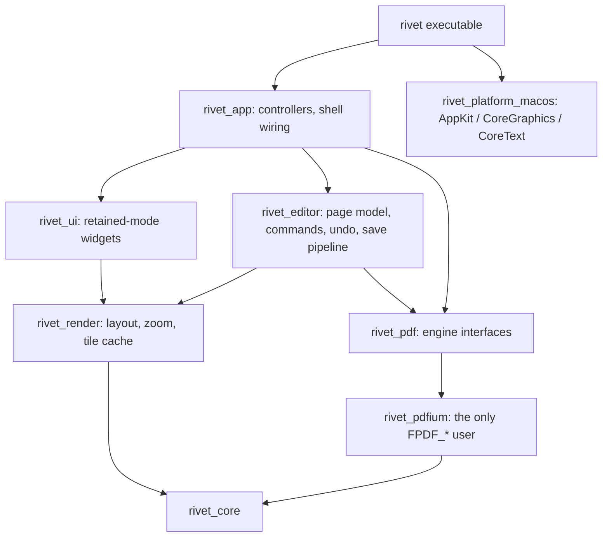

# Rivet

[](https://github.com/Husqvarnalox/RivetPDF/actions/workflows/ci.yml)
[](LICENSE)


A native, local-first PDF and Markdown editor written in C++23 (PDF via PDFium), with its own retained-mode UI toolkit, document model and command/undo stack.

> **First public preview (v0.1.0).** macOS is the only desktop shell today. Not ready for daily use; expect rough edges and data-loss-class bugs. Keep backups of documents you open.

## Overview

Rivet is a document editor for PDF and Markdown (parsed with the vendored MD4C, MIT). For PDF it edits *content*, not only annotations: existing text can be retyped in place, images replaced, and page objects moved, resized or deleted. PDFium is the only PDF backend; everything above it — document and page model, commands and undo, selection, tools, rendering strategy, caching and the UI widgets — is Rivet's own code. No Qt, Electron, WebView or other application framework is used.

Documents never leave the machine: Rivet has no network code of its own, no accounts and no telemetry (external links are handed to the system browser on click). PDF JavaScript and XFA are disabled by design ([ADR-0007](docs/adr/ADR-0007-pdf-javascript-xfa-disabled.md)).

## Status

| Area | State |
| --- | --- |
| Viewer: tabs, thumbnails, outline, search, text selection and copy, printing | Implemented (macOS) |
| Page editing: reorder, rotate, delete, duplicate, crop, insert/merge, extract, split, undo/redo | Implemented (macOS) |
| Saving: background Save / Save As with atomic file replacement, unsaved-changes prompts | Implemented (macOS) |
| Annotations: highlight, underline, strikeout, notes, ink, shapes, stamps | Implemented (macOS) |
| Content editing: select/move/resize/delete page objects, retype text, add text, replace images | Implemented (macOS), with the limits below |
| Forms, signatures, OCR, redaction, compression, encryption, document comparison | Not implemented |
| Windows / Linux shells | Not implemented. Portable layers are built and tested on Ubuntu/GCC in CI |
| Markdown: Rendered (read-only), Source (with live preview) and Split views; text editing with undo/redo and background save | Implemented (macOS) |
| Markdown WYSIWYG editing, export to PDF, print, Mermaid, math | Not implemented |

macOS is currently the primary supported desktop shell; the portable core layers build and are tested elsewhere.

### Known limitations

- Content editing is refused (the object stays selectable, the status bar says why) for Type3 fonts, text with unmappable glyphs, text under a clip, nested Form XObjects, and pages PDFium cannot regenerate faithfully (shading, inline images, patterns, hidden optional content).
- Existing objects cannot be reordered in z.
- Bundled fallback fonts (Arimo, Tinos, Cousine) cover Latin, Greek and Cyrillic only.
- Extract and split do not carry document-level structure (outline, metadata, forms, page labels).
- Undo history does not survive a save, and editing is paused while a save runs.
- Closing a window with several unsaved tabs saves only one per review pass.

Details: [Phase 3](docs/ARCHITECTURE.md#phase-3-status-closed-2026-10-02) and [Phase 5](docs/ARCHITECTURE.md#phase-5-status-closed-2026-10-03) status in the architecture document.

## Architecture

Statically linked CMake libraries with a strict dependency direction; platform code is confined to one layer.



- **Backend isolation.** `FPDF_*` types never leave `src/pdf/pdfium/`; a null engine is used when PDFium is not compiled in ([ADR-0003](docs/adr/ADR-0003-pdfium-abstraction-boundary.md)).
- **Rendering.** Tile-based, with a bounded, mutex-guarded tile cache and background rasterization ([ADR-0005](docs/adr/ADR-0005-tile-based-rendering.md)).
- **Threading.** A shared `std::jthread` pool, one `SerialExecutor` per open document, and a process-wide PDFium call gate (PDFium is not thread-safe, even across documents). UI state is main-thread only; completions return through `IMainThreadDispatcher` ([ADR-0006](docs/adr/ADR-0006-serialized-pdf-access-per-document.md)).
- **Editing.** Stable page identity, a command stack with undo/redo, atomic save replacement and background save with rebase ([ADR-0008](docs/adr/ADR-0008-page-model-and-stable-page-identity.md), [ADR-0009](docs/adr/ADR-0009-background-save-rebase-and-file-lifecycle.md), [ADR-0010](docs/adr/ADR-0010-atomic-save-replacement.md)).
- **Content editing.** A content-object model with deterministic text reflow, font embedding with bundled metric-compatible fallbacks, and regeneration of page content on save ([ADR-0014](docs/adr/ADR-0014-content-object-model.md)–[ADR-0017](docs/adr/ADR-0017-content-regeneration-and-save.md)).

Full description: [docs/ARCHITECTURE.md](docs/ARCHITECTURE.md). Design decisions: [docs/adr/](docs/adr/).

## Building

Prerequisites (macOS): Xcode with AppleClang 21+ (C++23), CMake ≥ 3.28, Ninja.

```sh
cmake --preset debug
cmake --build build/debug
ctest --test-dir build/debug
```

This builds **without** PDFium: the shell and all non-PDF subsystems work, PDF features are disabled at runtime. To open PDFs you must build PDFium yourself (Rivet never downloads it) and point CMake at it:

```sh
export RIVET_PDFIUM_ROOT=/absolute/path/to/pdfium-install
cmake --preset debug-pdfium
cmake --build build/debug-pdfium
build/debug-pdfium/src/platform/macos/rivet
```

PDFium build recipe: [docs/BUILDING_PDFIUM.md](docs/BUILDING_PDFIUM.md). Presets, sanitizers and more: [docs/BUILDING.md](docs/BUILDING.md).

## Testing

Unit and integration tests run through CTest (`ctest --test-dir build/debug`). The suite covers core utilities, render and tile-cache logic, the page model and commands, the save pipeline, annotation and content-editing logic (against generated PDF fixtures when PDFium is enabled), UI widgets and shell wiring.

CI (GitHub Actions) builds with `-Werror` and runs CTest on macOS (AppleClang) and Ubuntu (GCC) with PDFium disabled. PDFium-enabled and sanitizer (ASan/UBSan, TSan) configurations are run locally before releases; they are not in CI.

## Roadmap

Done: PDF viewer, page editing, annotations, content editing, Markdown viewing and source editing (see Status).
Next: form filling and signatures, then OCR, redaction, compression, encryption and document comparison. Windows and Linux shells have no schedule.

## Contributing

See [CONTRIBUTING.md](CONTRIBUTING.md). Security reports: [SECURITY.md](SECURITY.md). Changes: [CHANGELOG.md](CHANGELOG.md).

## License

[Mozilla Public License 2.0](LICENSE). Bundled fonts are under their own license (`third_party/fonts/LICENSE`).

Rivet is an independent project and is not affiliated with Adobe or any commercial PDF vendor.
